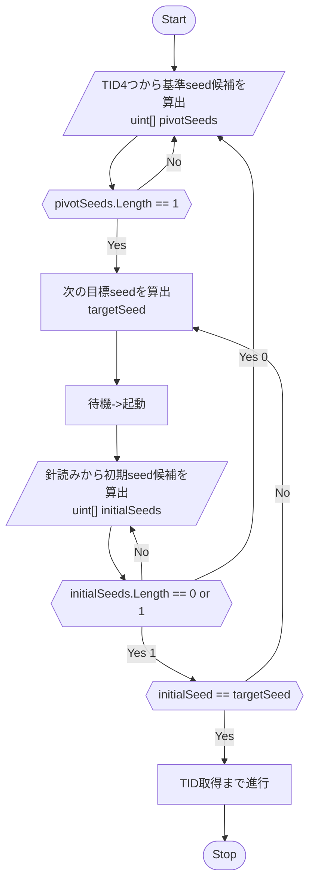

# フローチャート

```mermaid
flowchart TB
    start([Start]) -->

    get_pivot_seeds_from_tids[/"TID4つから基準seed候補を算出\nuint[] pivotSeeds"/] -->

    if_pivot_seeds_length_equals_1{{"pivotSeeds.Length == 1"}} --"No"-->
        get_pivot_seeds_from_tids
    
    if_pivot_seeds_length_equals_1 --"Yes"-->
    get_next_target_seed["次の目標seedを算出\ntargetSeed"] -->
    wait["待機->起動"] -->
    get_initial_seeds_from_hourglass[/"針読みから初期seed候補を算出\nuint[] initialSeeds"/] -->

    if_initial_seeds_length_equals_1{{"initialSeeds.Length == 0 or 1"}} --"No"-->
        get_initial_seeds_from_hourglass
    
    if_initial_seeds_length_equals_1 --"Yes 0"-->
        get_pivot_seeds_from_tids

    if_initial_seeds_length_equals_1 --"Yes 1"-->
    if_initial_seed_equals_target_seed{{"initialSeed == targetSeed"}} --"No"-->
        get_next_target_seed

    if_initial_seed_equals_target_seed --"Yes"-->
    get_tid["TID取得まで進行"] -->
    stop([Stop])
```

# 入力

- デバイス
- TID/SID
- 入力誤差
